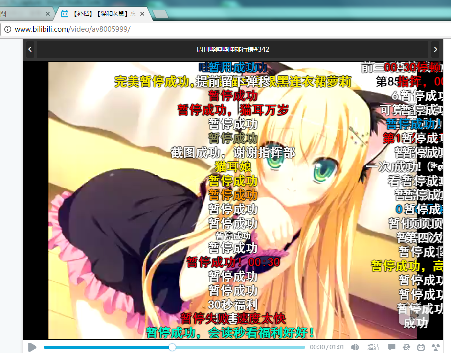
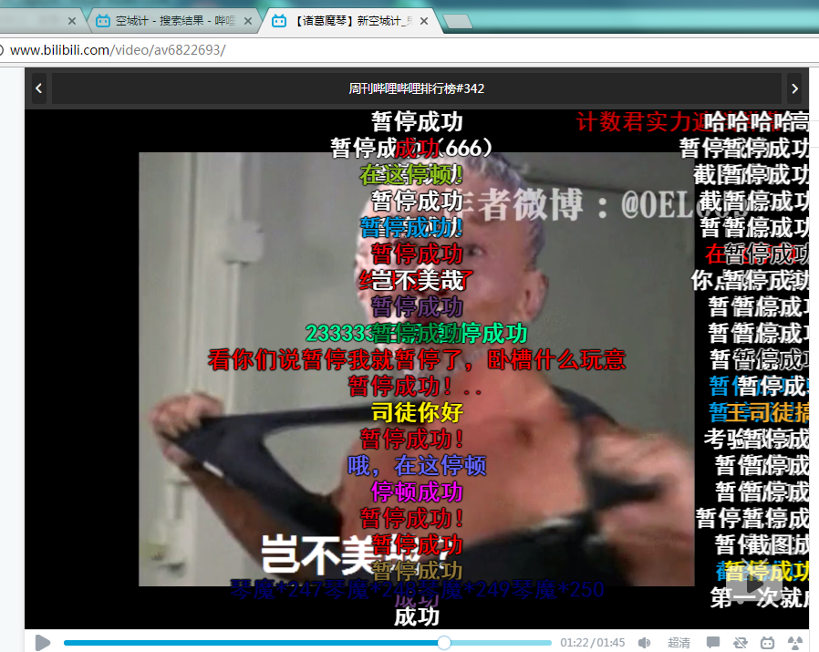
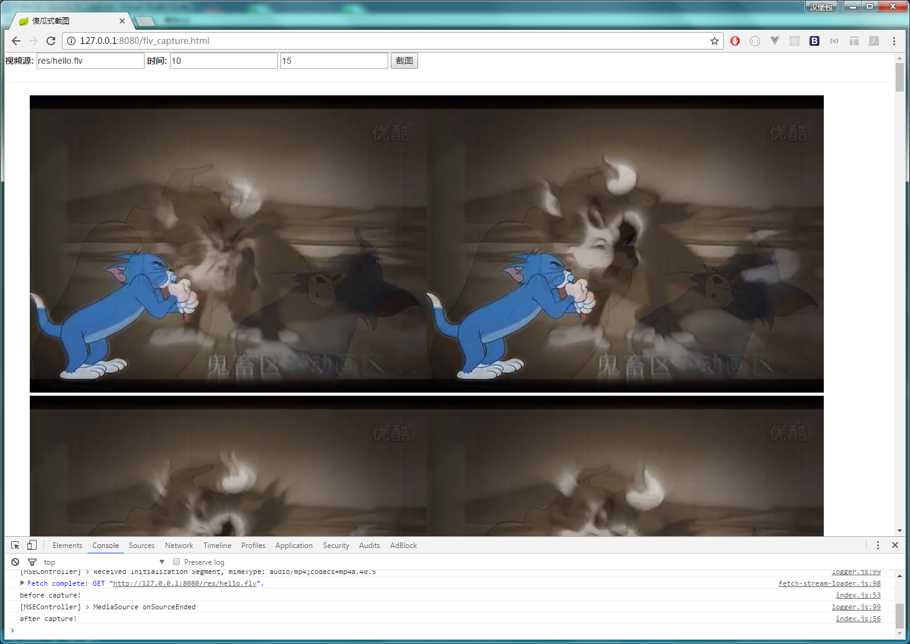

# 傻瓜式flv截图工具

# TODO:
- [x]截图
- [x]截图管理
- []chrome插件
- []稳定

B站看视频经常看到up主在视频中插入超快的一张图像, 比如
需要做个截图工具

[【猫和老鼠】忍者泥棒棒](http://www.bilibili.com/video/av8005999/)

[【诸葛魔琴】新空城计](http://www.bilibili.com/video/av6822693/)

原理:
使用[flv.js](https://github.com/Bilibili/flv.js) 往video上播放,再用canvas2d渲染

